# Cloudera Hands On
1. Ingresar al link del Workshop asignada
2. Registrar un correo e ingresar el código de registro
    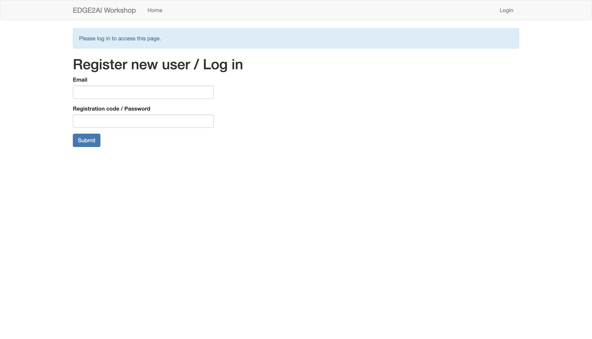
3. Completar el formulario de registro
4. Al entrar al laboratorio podrás ver una pantalla como la siguiente:
    
5. Dar click en el link de NiFi.
6. Esto abrirá la herramienta de NiFi como se muestra a continuación:
    
7. Descargar el template del Data Flow del siguiente link [dataflow-handson.xml](https://storage.googleapis.com/hands-on-cloudera/dataflow-handson.xml)
8. Cargar el template descargado en NiFi, dando click en upload template.
    
9. Dar click en Browse y seleccionar el archivo dataflow-handson.xml de tus archivos locales, como se muestra en la pantalla, dar click en upload:
    
10. Una vez cargado se mostrará una pantalla como la siguiente, dar click en ok:
    
11. Pocisionarse en la barra de herramientas en la herramienta template, y arrastrar hacia el espacio de trabajo:
    
12. Seleccionar el template acabado de importar, dar click en Add:
    
13. Una vez hecho esto aparecerá el data flow creado para el hands on: 
    
14. Regresar a la ventana del entorno del hands on, y dar click en donde dice **"Click here to open a SSH session"**:
    
15. Se abrirá una ventana como la siguiente, dar click en configuración avanzada:
    
16. Después dar click en **Continuar (no seguro)**:
    
17. Escribir el usuario `centos` contraseña `supersecret1`.
18. Estando ya logueado en la terminal ejecutar los siguientes comando para descargar los datos de prueba:
```bash
cd /media
sudo wget https://storage.googleapis.com/hands-on-cloudera/fraud_detection.csv
```
19. Una vez que se hayan descargado los datos de prueba podemos regresar a NiFi, dar click derecho en el "processor" `ListFile` y dar click en Start:
    
20. Ya que haya iniciado el processor podremos ver en la relación un de `success` un "Flow File" encolado, dar click derecho en la relación, dar click en `List queue`:
    
21. Podemos observar que hay un archivo en la cola de la relación:
    
22. Paso siguiente iniciaremos el processor `FetchFile`:
    
23. Nuevamente tendremos un elemento en la relación de `success` del processor `FetchFile`, dar click en `List queue`:
    
24. Nuevamente nos aparecerá un archivo en la cola, dar click en `View Details`:
    
25. Nos abrirá una ventana como la siguiente en la cual podemos descargar o visualizar el archivo con datos de prueba **(es aconsejable NO visualizarlo porque el archivo pesa más de 500MB y puede saturar tu navegador)**:
    
26. Dar click en la pestaña `Attributes`, podremos visualizar los atributos del `Flow File`, dar click en `OK`:
    
27. El siguiente procesador `ConvertRecord` tendrá un símbolo de warning, indicando que algo en la configuración es incorrecto. Damos click derecho y configuración:
    
28. Se abrirá la configuración del procesador y nos pocisionaremos en el tab properties. Paso siguiente en la propiedad `Record Reader` aparecerá una flecha, dar click en la flecha:
    
29. Nos mostrará una ventana con todos los controladores de la aplicación, los controladores es configuración adicional en los procesadores que pueden ser reutilizados por otros procesadores, dar click en el ícono de rayo para habilitar cada uno de ellos:
    
30. En la ventana que se despliega dar click en habilitar:
    
31. Una vez terminando de habilitar los controladores nuestro procesador `ConvertRecord` tendrá un símbolo de detenido, lo que indica que ya no tiene ningún problema en la configuración, y podemos iniciarlo:
    
32. Podemos continuar deteniendonos entre procesador y procesador para ver cada una de las transformaciones que va teniendo nuestro FlowFile inicial y ver como en cada transformación ya sea se modifica algo o se divide en más FlowFiles, continuar con estos pasos, al llegar al procesador `PublishKafkaRecord` nos detenemos y damos click derecho, y después en configuración:
    
33. Nos vamos a la pestaña propiedades para identificar la información del tópico que debemos de crear:
    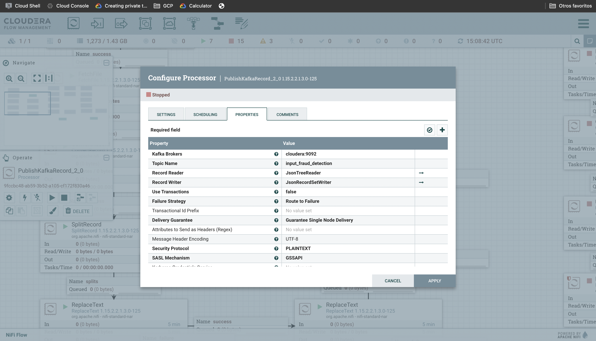
34. Paso siguiente, regresamos a la página inicial de nuestro laboratorio y damos click al link que dice SMM:
    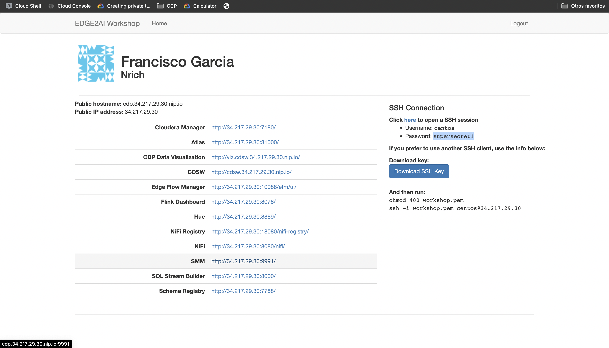
35. Esto nos redirigirá a la herramienta de cloudera manager SMM (Streaming Message Manager):
    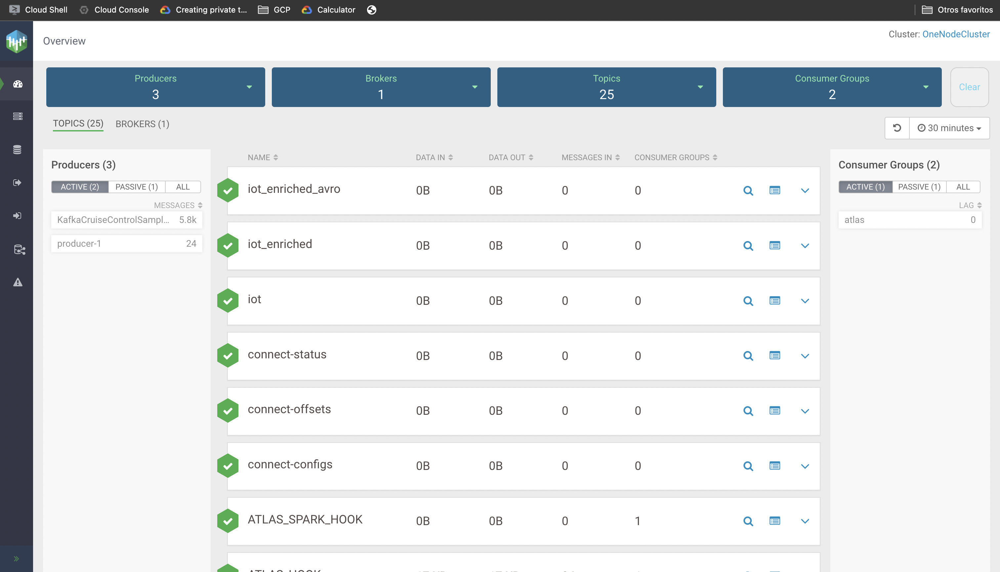
36. Paso siguiente nos colocamos en la barra de navegación y damos click en Topics:
    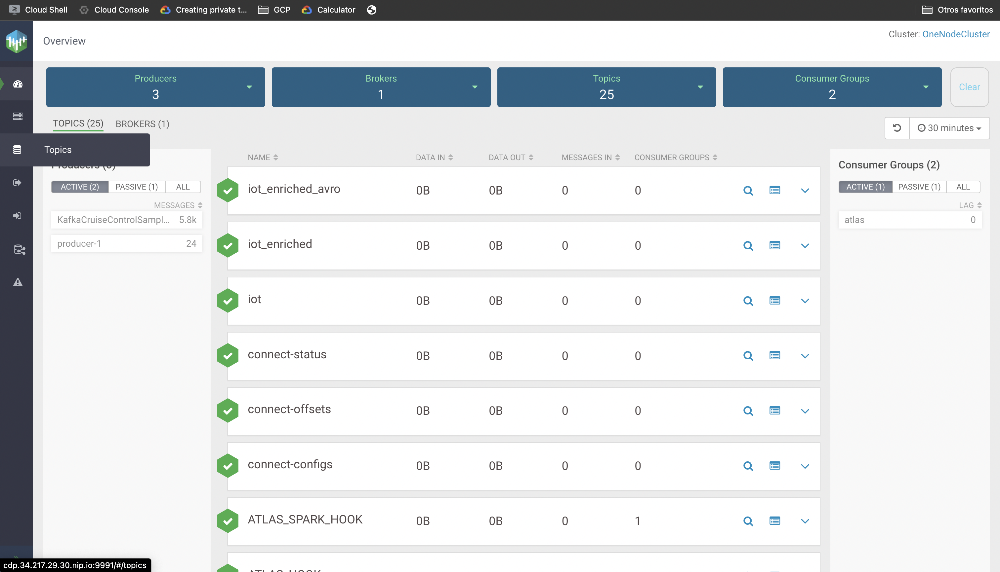
37. En esta sección podemos administrar nuestros tópicos, como por ejemplo el crear el tópico que necesitamos, damos click en el botón `Add New`:
    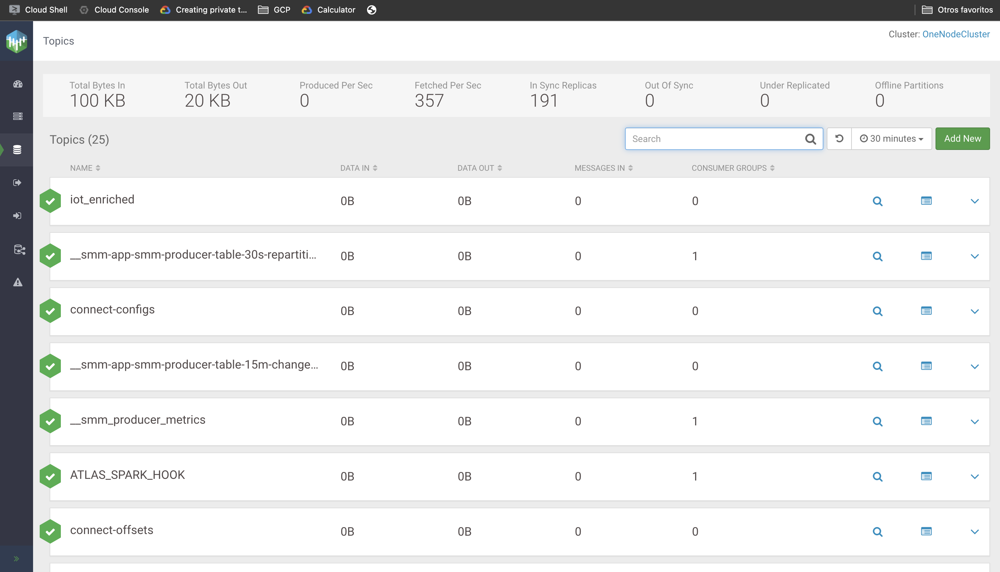
38. Indicamos el nombre del tópico `input_fraud_detection`, indicamos que tendrá 1 partición, un factor de replicación Low y una politica de limpieza Delete, como se muestra en la figura, damos click en Save:
    
39. Una vez creado el tópico, regresamos a nuestra interfaz de NiFi, e iniciamos el procesador `PublishKafkaRecord`:
    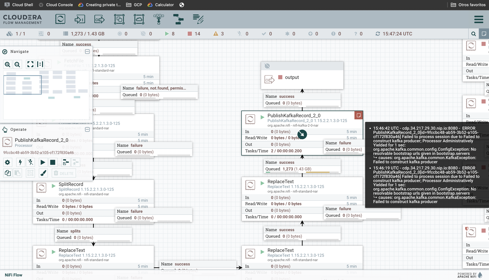
40. Como vimos en el paso anterior, hubo un error al intentar publicar nuestros mensajes en nuestro tópico nuevo, damos click en configurar a nuestro procesador `PublishKafkaRecord`, identificamos que en la propiedad Kafka Brokers tiene un valor incorrecto, en lugar de poner cloudera ponemos el nombre de nuestro host donde está nuestro Kafka:
    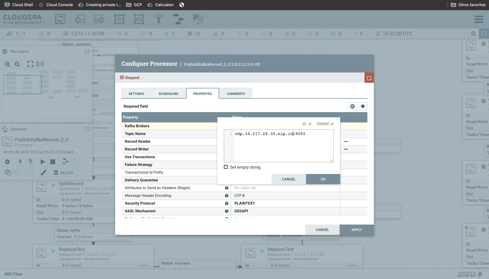
41. Para obtener el nombre del host debemos de ejecutar el siguiente comando en la terminal, copiamos y pegamos el valor en la propiedad Kafka Brokers de nuestro procesador `PublishKafkaRecord`:
    ```bash
    hostname
    ```
42. En el mismo procesor vamos a la pestaña Scheduling y modificamos el valor de la propiedad Run Schedule a cad 5 sec, para que el procesador se ejecute cada 5 segundos:
    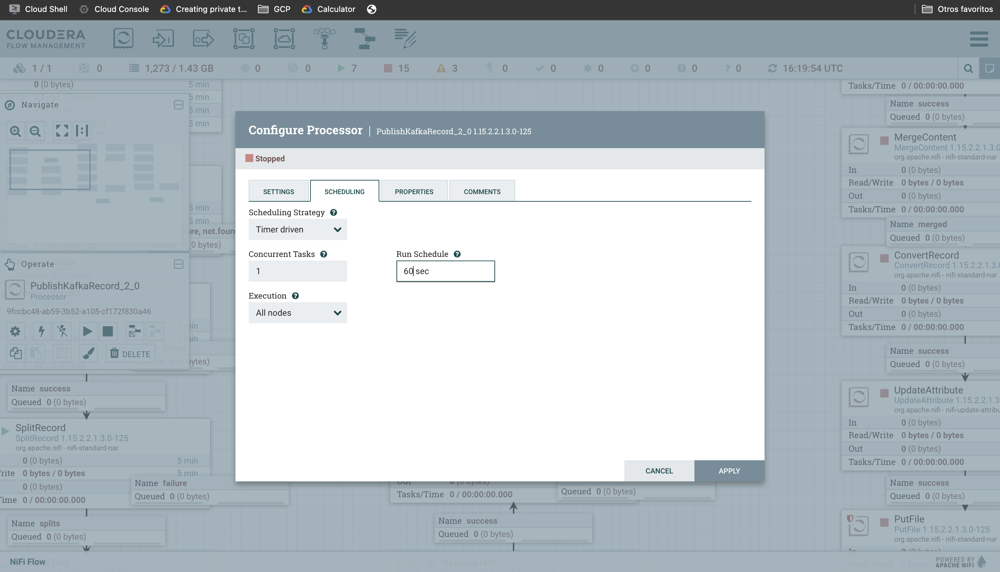
43. Aplicamos los cambios y ejecutamos el procesador `PublishKafkaRecord`, esta vez la relacion success nos indica que se publicó el mensaje:
    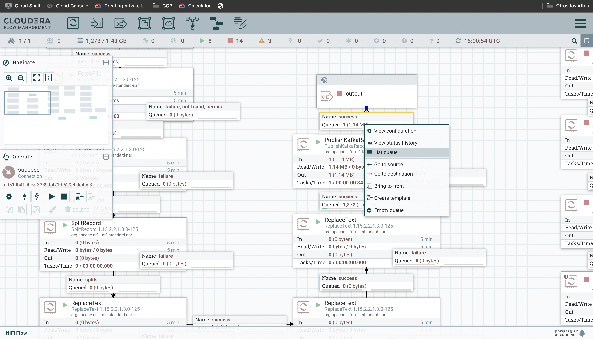
44. Como mencionamos nuestro flujo de datos tiene un tópico de entrada y 4 tópicos de salida, el proceso que separa estos mensajes es un proceso de java implementado con Kafka streams, antes de pasar al proceso de Kafka Streams debemos de **crear los 4 tópicos**, como observamos en nuestro data flow en NiFi tenemos 3 flujos de datos derivados para cada uno de los tópicos, el 4to flujo queda como ejercicio para el participante.
45. Damos click nuevamente en configurar en el procesador `ConsumerTransfer` y vamos a sus propiedades:
    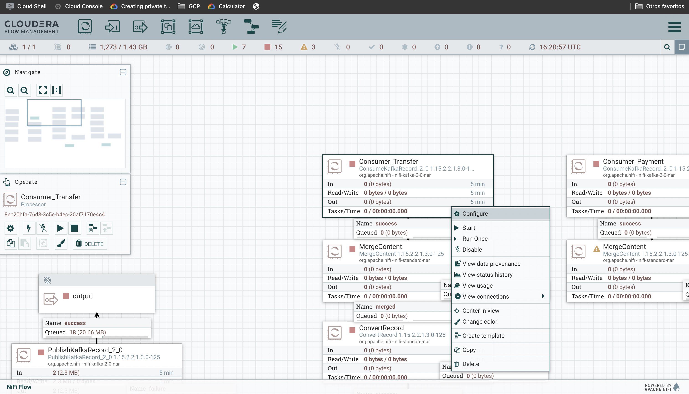
46. Nuevamente cambiamos el valor de la propiedad Kafka Brokers a nuestro host, esto por cada procesador que consuma algún tópico de kafka:
    
47. Vamos al SMM y creamos los tópicos de salida:
    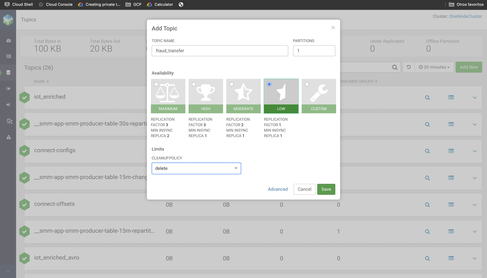
48. Regresamos a NiFi y damos start a los prosesadores que consumen datos de los tópicos de Kafka:
    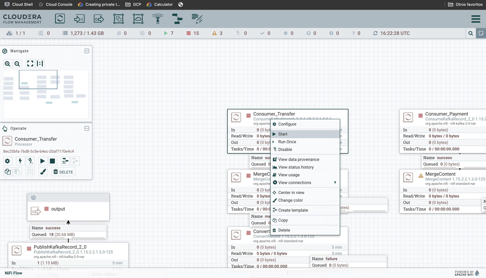
49. Al ejecutar esperamos unos momentos y nos damos cuenta de que los consumidores no traen información, la razón de esto es que hasta ahora el proceso de kafka stream no se está ejecutando.
50. Para ejecutar el proceso de kafka stream vamos a nuestra terminal y ejecutamos los siguientes comandos:
    ```bash
    wget https://storage.googleapis.com/hands-on-cloudera/KsCloudera.jar
    wget https://storage.googleapis.com/hands-on-cloudera/kstream.properties
    ```
52. Posteriormente ejecutamos el siguiente comando para iniciar nuestro proceso de kafka streams:
    ```bash
    java -Xmx2g -Xms2g -cp KsCloudera.jar com.richit.KstreamCloudera kstream.properties
    ````
53. Al ejecutar este comando la terminal mostrará una salida como la siguiente:
    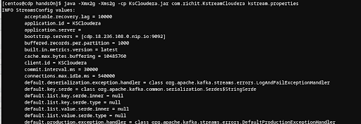